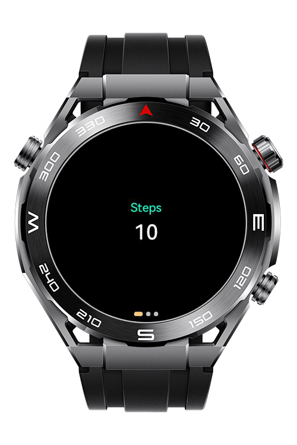
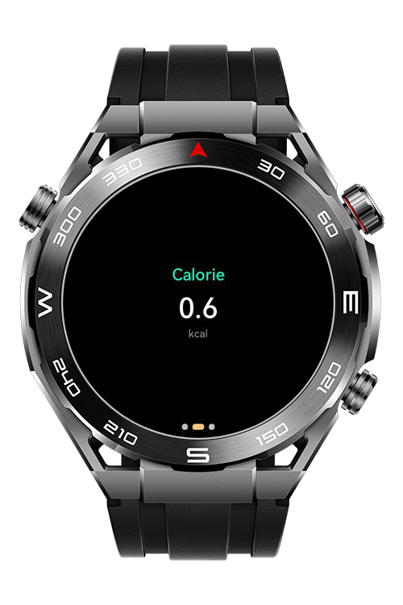
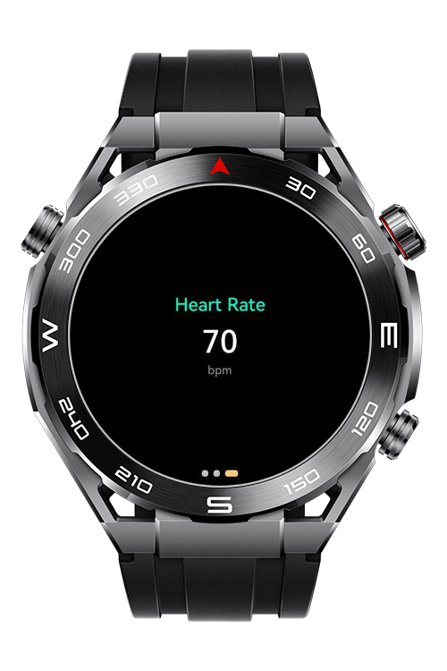

> **Note:** To access all shared projects, get information about environment setup, and view other guides, please visit [Explore-In-HMOS-Wearable Index](https://github.com/Explore-In-HMOS-Wearable/hmos-index).

# How to use Swiper in Lite Wearable?

HarmonyOS application that showing how Swiper can be implemented on lite wearable devices.

# Preview

<div>
  
  
  
</div>

# Use Cases

- The user can switch between steps, calories and heart rate pages by swiping the screen.
- Simulation mode is used to test the application's functionality without real sensor data. The user interface is automatically updated with randomly generated data.
- Each page has a dot indicator. The active page is highlighted in a different color, making it easy for the user to identify which page they are on.
- Users can monitor data received via a wearable device (e.g., Huawei Watch) in real time. Step count, calorie consumption, and heart rate data are dynamically updated. (dummy data)

# Tech Stack

- **Languages**: JS
- **Frameworks**: HarmonyOS SDK 4.0.0(10)
- **Tools**: DevEco Studio Vers 5.1.0.842

# Directory Structure

```
entry/src/main/js/MainAbility
│    pages/
│     └── index.css
│     └── index.hml
│     └── index.js
└──  i18n
      ├── en-US.json
      └── zh-CN.json
└──  app.js
```

# Constraints and Restrictions

## Supported Devices

- Huawei Lite Wearable

# LICENSE
**How to use Swiper in Lite Wearable?** is distributed under the terms of the MIT License.
See the [LICENSE](/LICENSE) for more information.
